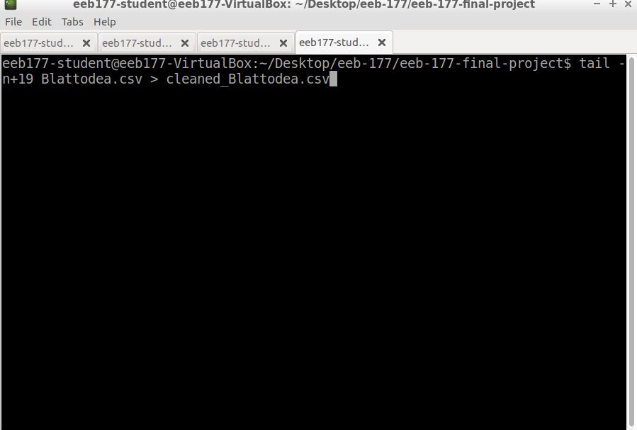

## Abstract.
The German cockroach (*Blattella germanica*) is the most common species of indoor cockroaches in the US. One of well-known physiological effect of cockroaches is that it is sensitive to the light. Previous studies indicate that cockroaches have varied sensitivity to different wavelengths of light, and that different wavelengths can have different effects on the circadian rhythm. Here I investigated how different wavelengths of light affect the amount of spontaneous locomotor activity in different time periods of the day. I hypothesized that the circadian rhythm is more strongly affected by wavelengths of light the cockroaches are more sensitive to. I entrained cockroaches in white, red, green, and blue light in a 12 hours light and 12 hours dark cycle and placed the cockroaches in a glass tank with 2.5 cm grids on its walls and counted the number of times the cockroaches cross the grid lines as a proxy to the amount of their locomotor activity.  This measurement was taken in 6 different 3-hour time periods of the day. The groups exhibited significantly different amount of locomotor activity (p<0.05) in 4 of the time periods, with the red group the most active in 3 of those periods. All groups tended to be less active during the day, but only the blue group showed an unambiguous difference in amount of locomotor activity in day and night. The result affirms the hypothesis in that while light suppresses cockroach activity, the activity failed to be suppressed as much by red light, which is invisible to cockroaches, and that considering other complications affecting the circadian rhythm such as variations in temperature, blue light, which cockroaches are more sensitive to, might have trumped the effects of other factors and established a clear pattern.

## Introduction.
Circadian rhythm affects how it affect indoor cockroaches at different times during the day. Circadian rhythm has also been shown to regulate learning and memory recall (Lubinski and Page 2016), locomotor activity, and olfactory sensitivity in cockroaches (Page and Koelling 2003). At present, homemade anti-roach strategies are mainly based on chemical methods to repel or trap cockroaches. But can I manipulate light to disrupt the circadian rhythm of the cockroaches to make them more vulnerable or less active to reduce the damage they cause, because of less effective memory recall or dampened senses? If I can, then this may make other homemade methods more effective, but in order to do so, I need to understand the circadian rhythm of cockroaches.
Different wavelengths of light have different effects on locomotor activities of cockroaches, with UV the most activating during transition from light to dark, blue green light most effective in molding a circadian rhythm that is maintained for longer (Leppla et al. 1989), and red and gold without detectable effects (Koehler et al. 1987). I replicated the previous study on the effect of wavelength of light on circadian rhythm of locomotor activity (Leppla et al. 1989), but used a different method. I hypothesized that the circadian rhythm of cockroaches is more strongly affected by wavelengths of light the cockroaches are more sensitive to (UV, blue)(Koehler et al. 1987) than wavelengths of light they’re less sensitive to (red), because stronger light can more strongly affect circadian rhythm than dimmer light (Wiedenmann 1977) and being more sensitive to light means having higher perceived intensity. I expected the blue light group to be the most active in the evening while least active during the day, and the red light group to behave as if in constant darkness, not showing a pronounced daily cycle. In addition to the circadian rhythm of cockroaches in current age, I manipulated another data file to see when and where cockroaches appeared , and how the light affected on cockroaches physiologically in that period. 

## Method.
I ordered adult German cockroaches (Blattella germanica) from Carolina Biological Supply Company (North Carolina, US) for my study, as this is one of the most common household species of cockroaches, and thus a suitable organism to study in order to advance pest control. Four to five cockroaches in different experimental groups were housed separately in four plastic food containers (16.5 cm x 10.9 cm x7.6 cm) with holes (diameter ~1 mm) on the wall for ventilation. All the containers were placed in a dark room; the sole sources of light were incandescent lamps shone into filters in the lids of the containers. The control group had a light grey filter and received white light, and the experimental groups had red, green, or blue filters and thus receiving red, green, and blue light. To separate the containers from light for neighboring containers when in the dark room, a 40 cm x 60 cm cardboard was placed between the containers. The light intensities of the lamps were adjusted make sure that the floor of all tanks were exposed to equal intensity of light (103 lux, similar to indoor light intensity during the day) in spite of the filters. The light intensity was measured by placing the probe of a light-meter (Fisher Scientific, New Hampshire, US) on the floor of the container with filter and lamp in place. Alternation of day and night was maintained in every group by an automatic timer (Century Products, California, US) controlling the lamps. The cockroaches were fed sugar and water ad libitum. All the cockroaches were exposed to 12 hours of light and 12 hours of darkness per day. During observation, each group had between 3 and 5 cockroaches (usually 4 or 5); the number varied as some cockroaches died or escaped and new cockroaches were added in their place.
To quantify locomotor activity, I taped gridded paper (side of each grid is 2.5 cm long) onto all walls of a glass tank (47.5 cm x 20 cm x25 cm) except the top (a mesh lid) and front (for observation) faces. I drew grids of the same size on the front wall, in order not to impede observation. I then moved the cockroaches into the glass tank, one group at a time, took videos of them, and counted the number of times the cockroaches crossed grid lines as a proxy to the amount of locomotor activity.
The videos were typically 15 minutes long, but when there were only 3 cockroaches left in a group due to death or escape, 20 minutes of video was taken for that group to average out random effects. In the latter case, the number of times the cockroaches crossed grid lines was then multiplied by 0.75 to calculate the number per 15 minutes in order to compare to other groups. The tank was placed in the light for the ease of imaging, and the cockroaches were placed back into their containers in the dark room after imaging. 
To investigate the circadian rhythm, I divided the day into 8 periods (hours are in 24 hour notations): dawn (transition from darkness to light, 5:00-8:00 in subjective time), morning (8:00-11:00), noon (11:00-14:00), afternoon (14:00-17:00), dusk (transition from light to darkness,17:00-20:00), early evening (20:00-23:00), night (23:00-2:00), and late night (2:00-5:00). The lights were turned on at 6:00 in the subjective time zone, and turned off at 18:00. To make all observations fit into my schedule, I shifted the time of day and night by 3 hours after each lab session by adjusting the automatic timer, letting the cockroach to entrain for at least two nights,  so the time period of interest would fit into my schedule. One video was taken for each group for each time period when observation was carried out. Due to limitation in time, I did not do the measurement for time periods 8-11 am and 11 am - 2 pm. 
One way ANOVA was used to compare the amount of locomotor activity in different groups in a given time periods and in the same group in different time periods, followed by Tukey HSD test to tell which group or time period was significantly different. Other than that, since the data set in the "Data.txt" file has a limited number and lack of information about occurence data, PBDB data from the Paleobiology data base website(https://paleobiodb.org/#/) was used, and order Blattodea was manipulated. To arrange chunk csv data file, unix shell commands and ipython notebook were used.


\begin{figure}[t]
\label{fig:pop}
\includegraphics[width=10cm, height=10cm,keepaspectratio]{containers.jpg}
\centering
\caption{Containers with different color filters.}
\end{figure}

\begin{figure}[t]
\label{fig:pop}
\includegraphics[width=10cm, height=10cm,keepaspectratio]{Lamps.jpg}
\centering
\caption{Lamps is on in the dark room}
\end{figure}

\begin{figure}[t]
\label{fig:pop}
\includegraphics[width=10cm, height=10cm,keepaspectratio]{Glasstank.jpg}
\centering
\caption{Glasstank covered with gridline papers}
\end{figure}
\clearpage


## Result (Wavelength part.)
Here is the main Rstudio code for analysis collected data of Data.txt file.

```{r , eval= T}
Roaches <- read.table(file = "Data.txt", header = T)
str(Roaches)
library(reshape2)
Roaches2 = melt(Roaches, id.vars = "Time", variable.name = "Color", value.name = "value")
library(ggplot2)
Roaches3 = aggregate(Roaches2$value, by = list(Roaches2$Time, Roaches2$Color), FUN = "mean", na.rm=T)
names(Roaches3) = c("Time", "Color", "value")
Roaches3$value[is.nan(Roaches3$value)] <- NA
Roaches4 = aggregate(Roaches2$value, by = list(Roaches2$Time, Roaches2$Color), FUN = "sd", na.rm=T)
names(Roaches4) = c("Time", "Color", "valuesd")
Roaches5 = merge(Roaches3, Roaches4, by = c("Time", "Color"))
Roaches5$Color = factor(Roaches5$Color, levels = levels(Roaches5$Color)[c(4,3,2,1)])
Roaches5$Time = factor(Roaches5$Time, levels = levels(Roaches5$Time)[c(3,6,1,2,4,5)])
ggplot(Roaches5, aes(x=Time, y=value, fill = Color)) + geom_bar(position = "dodge", stat="identity") + geom_errorbar(data = Roaches5, aes(fill = Color, ymin = value-valuesd, ymax = value+valuesd), position = "dodge") +labs(x="Time period", y="# times crossed gridlines")

#Figure 4.
#Fig 4. Average number of times each cockroach crossed grid lines in 15 minutes. 
#The error bars denote standard deviation within the group, and the time on the
#x-axis stands for the beginning of the corresponding 3-hour time period in the 
#subjective time zone of the cockroaches, in 24 hour notation. p<0.05 (*)


ggplot(Roaches5, aes(x=Time, y=value)) + geom_line(aes(group = Color, color = Color)) +geom_point(aes(group = Color, color = Color)) +geom_errorbar(data = Roaches5, aes(fill = Color, color = Color, ymin = value-valuesd, ymax = value+valuesd, width = 0.1)) + labs(x="Time period", y="# times crossed gridlines")

#Figure 5.
#Fig 5. Average number of times each cockroach crossed grid lines in 15 minutes. 
#The error bars denote standard deviation within the group, and the time on the 
#x-axis stands for the beginning of the corresponding 3-hour time period. Each 
#panel contains data only for the corresponding group. p<0.0001(****), p<0.05(*), 
#p<0.1(.).

#ANOVA
Color.mod1 = lm(value ~ Color, data = Roaches5)
summary(Color.mod1)
anova(Color.mod1)
#COlor not significantly different on average
Time.mod1 = lm(value ~ Time, data = Roaches5)
summary(Time.mod1)
anova(Time.mod1)
#All time periods are significantly different from each other

#Compare different colors in each time period
Roaches.loop = data.frame(Color = Roaches2$Color[1:20])
anova.results = vector("list",6)
which.sig = vector("list",6)
Time = c("2:00:00", "5:00:00", "14:00:00", "17:00:00", "20:00:00", "23:00:00")
for(i in 1:6){
  Roaches.loop$Color = Roaches2$Color[Roaches2$Time == Time[i]]
  Roaches.loop$value = Roaches2$value[Roaches2$Time == Time[i]]
  mod1 = lm(value ~ Color, data = Roaches.loop)
  anova.results[[i]] = anova(mod1)
  names(anova.results)[i] = paste("Time period", Time[i], sep = " ")
  #Tukey HSD
  a1 = aov(Roaches.loop$value ~ Roaches.loop$Color)
  which.sig[[i]] = TukeyHSD(x=a1, 'Roaches.loop$Color')
}
```
\clearpage

### Different levels of locomotor activity among groups within a time period.
As expected, the cockroaches tended to be less active during the day than during the night (Fig.4). In 4 out of the 6 time periods investigated, I observed significant differences in amount of locomotor activity among different groups (Fig.4, red-control after 2:00, red-green after 14:00, red-blue after 20:00, and red-blue and green-blue after 23:00). Notably, in 3 out of the 4 time periods in which there was some difference among groups, the red group was the most active, significantly more active than some other group (Fig.4, time periods after 2:00, 14:00, and 20:00). However, by 23:00, the red group and the green group were significantly less active than the blue group (Fig.4).

### Variation of amount of locomotor activity within groups at different time.
While all groups tended to be less active during the day, only the red and blue groups showed statistically significant differences in amount of locomotor activity in different time periods (Fig.5). However, only the blue group showed the unambiguous trend of more activity in the evening and less during the day, as all other groups showed decreased activity during the night (Fig.5). In the red group, the amount of activity in the time period after 2:00 was significantly higher than that in all other time periods (Fig.5).

## Result(PBDB data.)
### Time period of the first cockroach appeared.
At first, raw pbdb file on the paleobiology database website(https://paleobiodb.org/#/) was downloaded.
Raw Blattodea PBDB data csv file containing unnecessary data such as title, URL, and indices, so it was formatted with tail command to remove the first top 19 lines.


\clearpage

Here is another step to modify formatted file again for maximum and minimum age of fossils.
After the works done, Every data is stored into the another newly formatted file as
Blattodea-ranges.csv.
```{python ,eval=F}
infile= "cleaned_Blattodea.csv"
with open(infile, "r") as ff:
     Blattodea_recs=ff.readlines()[0:]

from collections import defaultdict
species_ranges=defaultdict(list)

# make a dictionary
for line in Blattodea_recs:
    species=line.split('","')[5]
    minage=line.split('","')[10]
    maxage=line.split('","')[11]
    mean_age=(float(minage) + float(maxage)) /2
    species_ranges[species].append(mean_age)

output=open("Blattodea-ranges.csv","w")

new_ranges=sorted(species_ranges.keys())

for key in new_ranges:
    ages=species_ranges[key]
    minage=min(ages)
    maxage=max(ages)
    genus=key.split(" ")[0]
    species=key
    #print(genus,key,minage,maxage)
    
    outline="{},{},{},{}\n".format(genus,species,minage,maxage)
    
    output.write(outline)
```


To track down the occurence fossil data of blattodea germanica, it was necessary to filter the formatted range files again. This code is the defined function that search the species I'm looking for and store the data into another csv file.

```{python, eval=T}
def findgenus(genusname):
    file=open("Blattodea-ranges.csv","r")
    fossilrecords=file.readlines()
    
    outfile=open("Periplanetafossil.csv","w")
    
    for line in fossilrecords:
        recordgenus=line.split(",")
        if recordgenus[0]==genusname:
            fossilage="{},{},{},{}".format(recordgenus[0],recordgenus[1],recordgenus[2],recordgenus[3])
            print(fossilage)
            
            outfile.write(fossilage)

findgenus("Periplaneta")
```

Periplaneta is a genus of cockroach, and plot fossil occurence data using ggplot2 graph on Rstudio program. The data is feasible to show which species has the oldest fossil age.
```{r, eval=T}
library(ggplot2)
setwd("~/Desktop/eeb-177/eeb-177-final-project")
Blattodea <- read.csv("Periplanetafossil.csv", header = F, as.is = T)
names(Blattodea) <- c("genus", "species", "minage", "maxage")
head(Blattodea)
Blattodea_occ <- ggplot(Blattodea, aes( x = species, maxage, colour = genus))


Blattodea_occ + geom_linerange(aes(ymin = minage, ymax = maxage + 0.5)) + theme(legend.position="none") +  coord_flip() +  theme(axis.text.y = element_text(size=10)) + scale_y_continuous(limits=c(0, 100), expand = c(0, 0), breaks=c(0, 10, 20, 30, 40, 50, 60)) + labs(title = "Periplaneta Fossil Occurrences", x = "Species", y = "Mya") + theme(plot.title = element_text(hjust = 0.5, size=22, face = "bold"), axis.title =element_text(size=20)) 
ggsave("Periplaneta.pdf", limitsize=FALSE)
```
From the given data set, the first species of Periplaneta is Perplaneta houlberti appeared in 57.6millions ago.

### where the first cockroach appeared from.
To track down the region of cockroaches, PBDB file contaning coordinations( longitudes and latitudes ) were formatted.
```{python, Eval=F}
infile= "cleaned_Blattodeamap.csv"
with open(infile, "r") as ff:
     Blattodea_recs=ff.readlines()[0:]

from collections import defaultdict
species_ranges=defaultdict(list)

for line in Blattodea_recs:
    species=line.split('","')[5]
    lon=line.split('","')[13]
    lat=line.split('","')[14]
    

    species_ranges[species].append(lon)
    species_ranges[species].append(lat)

output=open("Blattodeamap-ranges.csv","w")
new_ranges=sorted(species_ranges.keys())

for key in new_ranges:
    edited=species_ranges[key]
    genus=key.split(" ")[0]
    species=key
    lon=edited[0]
    lat=edited[1].replace('"','')
    #print(genus,key,lon,lat)
    
    outline="{},{},{},{}\n".format(genus,species,lon,lat)
    output.write(outline)

```
It's similar step as generating fossil data csv file, but newly created file contains 
longitudes and latitudes information of each species only.
```{python , Eval=T}
def findgenus(name):
    file=open("Blattodeamap-ranges.csv","r")
    records=file.readlines()
    
    output=open("Periplaneta.csv","w")
    
    for line in records:
        recordgenus= line.split(",")
        if recordgenus[0]==name:
            outline="{},{},{},{}".format(recordgenus[0],recordgenus[1],recordgenus[2],
            recordgenus[3])
            print(outline)          
            #genus, species, longitude, lattitude data stored in Periplaneta.csv
            
            output.write(outline)
            

findgenus("Periplaneta")
```
From the given data, Map, which is Rstudio package is creatd, and Periplaneta species were plotted.
Red points are clearly seen in the map. That's the region where the cockroaches appeared at the first time.

```{r}
library(maps)
setwd("~/Desktop/eeb-177/eeb-177-final-project")
map()
Periplaneta <- read.csv("Periplaneta.csv", header=FALSE)
colnames(Periplaneta) <- c("Genus","Species","longitude","latitude")
points(Periplaneta$longitude, Periplaneta$latitude, col="red", cex=.9)
```

As the graph above , cockroach appeared from France, Germany, Poland, and China.
From fossil data, "Perplaneta houlberti" appeared as the first cockroach in the world, and the next map generates region of the Periplaneta houlberti appeared by applying longitude and latitude information.
```{r}
library(maps)
map()
points(2.900000,46.099998, col = "red", cex = 1.5)
```

As the graph above, Blattella Germanica is origin from Germany, and they are the most common
indoor roaches in the U.S now.


## Discussion.
Results are not entirely consistent with those of the study I tried to replicate (Leppla et al. 1989). The previous study found that cockroaches entrained in white, blue-green, and UV lights all showed bimodal peaks of locomotor activity near dawn and dusk; the blue-green group showed the most persistent circadian rhythm after shifting into constant darkness (Leppla et al. 1989). While the decreased activity after 23:00 in the red and green group and after 2:00 in the control group might be consistent with the bimodal peaks previously described (Leppla et al. 1989), I did not observe such bimodal peaks in time periods after 5:00 and 17:00 when such transition happened (Fig.5). This can possibly be due to the different methods used to quantify locomotor activity. As ease side of a grid was 2.5 cm long, while the body lengths of the cockroaches were typically less than 1.5 cm, my method is blind to small movements, such as rotations and back and forth movements without crossing grid lines often observed in the videos. On the other hand, the method of the previous study (Leppla et al. 1989) used the number of times cockroaches touched a stationary sensor as the proxy for amount of locomotor activity. That method is more sensitive to small local movements, since a cockroach can repeatedly touch the sensor when staying nearby, doing such small movements, but is not as sensitive to long range movements, as when a cockroach runs over the sensor while traveling from one side of the tank to the other, it does not touch the sensor many times. In sum, the discrepancy between my results and that of the previous study (Leppla et al. 1989) may be that the methods in the two studies skewed towards different kinds of motions of the cockroaches.
That only the blue group showed the unambiguous pattern of more activity at night than during the day (Fig.5) supports the hypothesis that blue light has stronger effects on the circadian rhythm of cockroaches. Moreover, that the red group tended to be more active than other groups in most of the time periods in which there was a difference among groups may be consistent with the prediction that the red group would behave as if in constant darkness, because light suppresses activity in cockroaches, which are naturally nocturnal, but which cannot see red light (Koehler et al. 1987). 
The ambiguity of rhythmicity of locomotor activity in the non-blue groups may be due to several limitations of this study: First, temperature can be a major confounder as cockroaches can be entrained by temperature cycles (Page 1985) and temperature affects the metabolic rate and thus activity and behavior of cockroaches, which are poikilotherms. In Los Angeles, where this study was conducted, the night is usually significantly colder than the day; in February and March, when this study was conducted, the daily temperature range is on average approximately 9 degrees Celsius (US Climate Data 2017). However, I failed to keep the temperature constant; entraining the cockroaches to the outside daily cycle, which is different from the subjective time zone controlled by the light, the temperature may be causing the cockroaches to be less active than expected in evening time periods in the subjective time zone, as all the measurements were done during the day. This may also account for lack of significant differences in amount of locomotor activities in the green and control groups. The increased activity in the red group compared to other groups in several time periods (Fig.4) suggests that light still has some effects on the circadian rhythm in addition to temperature. 
Second, the humidity changed widely throughout this study as spring approached. Humidity can affect the behavior of cockroaches as well in relation to their hydration status (Doi and Toh 1992), and the hydration of the cockroaches might have been different from day to day as the water provided for them dried out more quickly on drier days. As the measurements were done in different days, which had different temperatures and humidity, the amount of locomotor activity of the cockroaches cannot be solely accounted for by wavelengths of light. If temperature and humidity were affecting the results as just described, then by suggesting that blue light trumps other factors in shaping the circadian rhythm, the unambiguous day-night pattern in the blue group further supports my hypothesis.
Third, I were confined to the small sample size (4-5 cockroaches per group) due to death and escape of cockroaches resulting from my inappropriate handling. Fourth, my results may not accurately reflect the amount of activity of cockroaches entrained in different wavelengths of light throughout the day, since I shifted the subjective time zone so rapidly that the cockroaches may not have enough time to acclimate to new time zones and I caused injury in some cockroaches due to inappropriate handling. 
my results could have been clearer if I used larger sample size with proper handling, carried out measurements for more than one daily cycle, and set up separate groups for each time zone in each color of light in constant temperature and humidity to increase the power to detect differences and avoid the complications of jet lag, temperature, and humidity. Rhythmicity can be more clearly demonstrated by showing a repeated pattern in more than one daily cycle.
my results imply that artificial daylight balanced lighting, which is stronger in the blue part of the the visible spectrum, must have stronger effect on the circadian rhythm of indoor cockroaches than soft white artificial lighting, which appears more yellowish. Perhaps cockroaches are more active in the dark in households using daylight balanced lighting and those using soft white lighting, so the former households should enhance pest control measures. To further elucidate the effect of wavelengths of light on circadian rhythm of cockroaches, future studies should be conducted. First, since many generations of cockroaches have lived in homes with artificial lighting, which varies in timing, colors (e.g. incandescent, fluorescent, LED, daylight balanced, soft white, holiday and party lights, and etc.), and intensity depending on the wide range of personal habits, how cockroaches have adapted to artificial lighting and the implications of such adaptations should be studied in order to develop more effective pest control. Second, both local and long range movements of cockroaches should be quantified. Indeed, the type of movement in different time periods in different wavelengths of light has practical implications. For instance, many restaurants use UV light to sanitize after business hours; if cockroaches entrained in UV have longer range movements than local movements, then they can do more damage than otherwise. Third, to further demonstrate that the circadian rhythm of cockroaches are more strongly affected by wavelengths of light the cockroaches are more sensitive to, photoreceptors for certain wavelengths such as blue, green, or UV - but not other wavelengths, should be ablated by genetic knockouts and locomotor activities of the cockroaches entrained in the wavelength whose photoreceptor has been ablated should be measured.

### Discussion(PBDB)
The first cockroach was Periplaneta houlberti in 57.6 millions ago, and it appeared in Germany. It was during Paleogene period, during that time Paleocene-Eocene Thermal Maximum occured which startd 55millions ago, and about 8 degree celcius warmer like global warming than today (Bowen 2015).Moreover, there were many volcanic acitivites that it caused increase level of carbon dioxide level. Evaporation rate of sea made the weather tropic, and the land was highly moistured. Wavelengths of the light was not significantly different from today, but Periplaneta houlberti adapted different circadian rhyhtm in that environment.


\clearpage

## References
Doi, N., & Toh, Y. (1992). Modification of cockroach behavior to environmental humidity change by dehydration (Dictyoptera: Blattidae). Journal of Insect Behavior, 5(4), 479-490. doi:10.1007/BF01058193


Koehler, P. G., Agee, H. R., Leppla, N. C., & Patterson, R. S. (1987). Spectral Sensitivity and Behavioral Response to Light Quality in the German Cockroach (Dictyoptera: Blattellidae). Annals of the Entomological Society of America, 80(6), 820-822. 


Leppla, N. C., Koehler, P. G., & Agee, H. R. (1989). Circadian rhythms of the German cockroach (Dictyoptera: Blattellidae): Locomotion in response to different photoperiods and wavelengths of light. Journal of Insect Physiology, 35(1), 63-66. 


Lubinski, A. J., & Page, T. L. (2016). The Optic Lobes Regulate Circadian Rhythms of Olfactory Learning and Memory in the Cockroach. J Biol Rhythms, 31(2), 161-169. doi:10.1177/0748730415622710


Page, T. L. (1985). Circadian organization in cockroaches: Effects of temperature cycles on locomotor activity. Journal of Insect Physiology, 31(3), 235-242. 


Page, T. L., & Koelling, E. (2003). Circadian rhythm in olfactory response in the antennae controlled by the optic lobe in the cockroach. J Insect Physiol, 49(7), 697-707. 


U.S. Climate Data. (2017). Retrieved March 16, 2017, from U.S. Climate Data: http://www.usclimatedata.com/climate/los-angeles/california/united-states/usca1339/2017/1


Wiedenmann G. (1977). Weak and strong phase shifting in the activity rhythm of Leucophaea maderae (Blaberidae) after light pulses of high intensity. Zeitschrift für Naturforschung. 32(5-6):464-465

Bowen; et al. (2015). "Two massive, rapid releases of carbon during the onset of the Palaeocene–Eocene thermal maximum". Nature. 8: 44. doi:10.1038/ngeo2316
